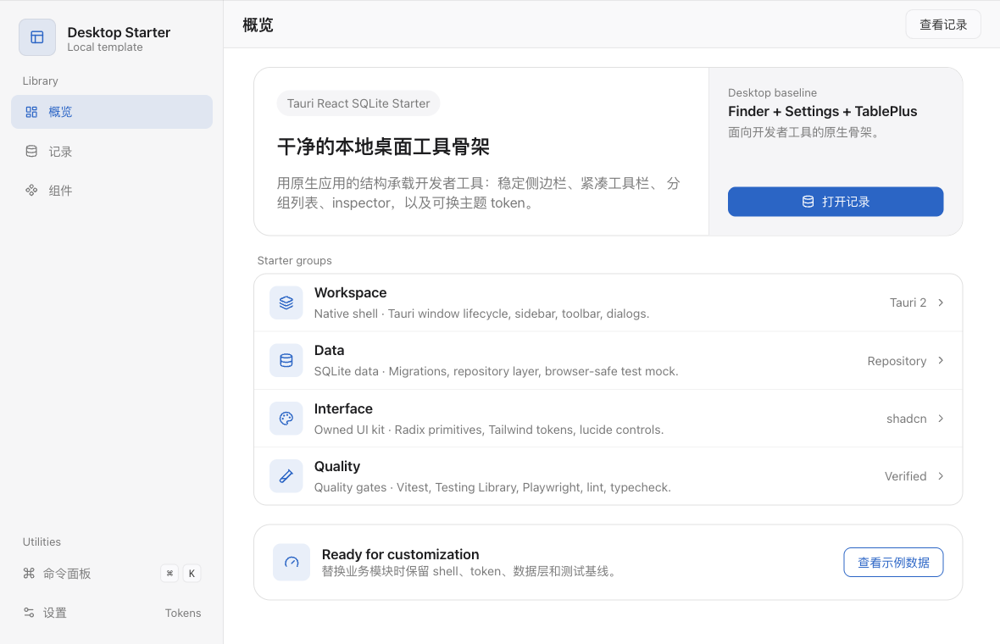

# Tauri React Starter

[](https://github.com/admin9-labs/tauri-react-starter/actions/workflows/check.yml)
[](LICENSE)

基于 **Tauri 2 + React + TypeScript + SQLite** 的本地桌面工具骨架，由 ADMIN9 Labs 维护。提供应用 Shell、主题设置、命令面板、项目自有 Radix/Tailwind UI 控件，以及示例记录的数据层与测试基线。

适合在此基础上开发自己的桌面应用。示例业务保持中性，不包含账号管理、云同步或真实用户数据。

## 界面预览



以上为浏览器预览，使用内存示例数据；原生窗口和 SQLite 验收范围见 [验证记录](docs/tech/starter-validation.md)。

## 包含什么

- 固定侧边栏、页面工具栏、详情编辑与删除确认。
- 浅色、深色和系统主题；`⌘/Ctrl + K` 命令面板。
- 项目自有 UI primitives、组合 patterns 和设计规范。
- SQLite migration、repository 与显式字段映射；浏览器使用严格的示例 mock。
- TypeScript、ESLint、Prettier、Vitest、Testing Library 和 Playwright。
- 固定工具链、两份锁文件，以及 GitHub Actions 的检查和 macOS 调试构建。

## 快速开始

完整检查使用 Node **24.20.0**、pnpm **11.10.0**、Rust **1.93.1**（含 rustfmt），版本分别由 `.node-version`、`package.json` 和 `rust-toolchain.toml` 管理。原生开发另需准备 [Tauri 系统依赖](https://v2.tauri.app/start/prerequisites/)。

```bash
git clone https://github.com/admin9-labs/tauri-react-starter.git
cd tauri-react-starter
pnpm install --frozen-lockfile
pnpm dev
```

浏览器地址为 `http://localhost:1420`，无须登录。浏览器示例数据在刷新后重置。

启动原生应用：

```bash
pnpm tauri dev
```

原生使用本地 SQLite。首次派生应用运行前，按 [开发者入口](docs/tech/developer-start.md#复制与应用身份) 更换应用 identifier、名称和主题存储命名空间，避免与模板共用应用身份及数据目录。

## 检查与构建

```bash
# 首次运行 E2E 前安装测试浏览器
pnpm exec playwright install chromium

# 工具链、类型、lint、格式、单测、E2E、前端构建及 Rust 检查
pnpm check

# 原生调试构建；不是正式签名安装包
pnpm tauri build --debug --bundles app --no-sign
```

上面的 `app` bundle 命令适用于 macOS。日常改动按 [验证矩阵](docs/tech/engineering.md#验证范围) 选择相关检查，不必每次执行完整基线。

## 平台与数据边界

- 已有本地运行证据的平台为 **macOS / arm64**；默认窗口为 1180×760，最小支持目标为 1100×680 逻辑像素。
- Windows、Linux、正式签名安装包尚未验证，不宣称已有跨平台发行支持。
- 浏览器 mock 仅演示数据流，不能证明真实 SQL、迁移、事务或持久化正确。
- 这是本地单用户 starter，没有认证、云同步或数据库加密。业务能力和安全要求由派生项目定义。

## 文档入口

- [骨架定位](docs/product/02-prd.md)：目标与范围。
- [开发者入口](docs/tech/developer-start.md)：复制、应用身份和替换示例。
- [工程契约与验证](docs/tech/engineering.md)：依赖、数据边界、工具和检查方法。
- [设计规范](DESIGN.md)与 [UI 组件规范](docs/tech/ui-components.md)：视觉、交互和组件 API。
- [项目索引](docs/project-index/README.md)：入口、调用关系和修改位置。
- [验收标准](docs/product/07-acceptance-criteria.md)与 [验证记录](docs/tech/starter-validation.md)：通过条件及实际覆盖范围。
- [贡献指南](CONTRIBUTING.md)、[安全报告](SECURITY.md)与 [代理工作约束](AGENTS.md)。

## 许可证

项目源码采用 [MIT](LICENSE)。随仓库分发的 Geist Mono 字体及 Tauri 模板图标保留各自许可证，详见 [第三方声明](THIRD_PARTY_NOTICES.md)。
